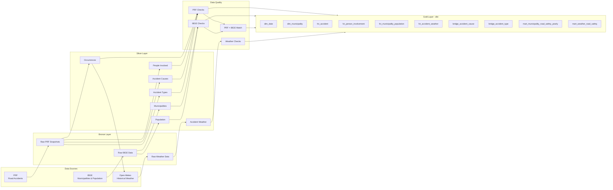

# Ceará Road Safety Data Platform

End-to-end **Data Engineering platform for road safety analysis in Ceará, Brazil**, integrating public data from **PRF**, **IBGE**, and **Open-Meteo**.

The project implements a complete data lifecycle from ingestion and raw storage to analytical modeling, data quality validation, orchestration, and automated CI.

## Overview

The platform was designed to answer road-safety questions using reproducible and auditable data pipelines.

It combines:

- Brazilian Federal Highway Police accident data;
- official municipality and population data from IBGE;
- historical weather data from Open-Meteo;
- dimensional and analytical models built with dbt;
- orchestration with Apache Airflow;
- automated validation with GitHub Actions.

The architecture follows a **Bronze → Silver → Gold** approach.



Apache Airflow orchestrates the ingestion, transformation, validation, weather enrichment, and dbt stages.

---

## Architecture

### Bronze

The Bronze layer preserves data as close as possible to the original source.

PRF ingestion uses immutable snapshots and records metadata including:

- source;
- dataset;
- year;
- ingestion timestamp;
- file path;
- file size;
- SHA-256 checksum;
- ingestion status.

Content-based idempotency prevents the same source file from being stored multiple times.

Example:

```text
data/bronze/prf/
└── year=2026/
    └── dataset=occurrence/
        └── snapshot=YYYYMMDDTHHMMSSZ/
            └── datatran2026.zip
```

---

### Silver

The Silver layer contains typed, normalized, and validated datasets.

Main datasets:

```text
PRF
├── occurrence
├── person
├── accident_cause
└── accident_type

IBGE
├── municipality
└── municipality_population

Open-Meteo
└── accident_weather
```

PRF accident data remains **Brazil-wide in Silver**.

The Ceará-specific analytical scope is applied downstream, keeping the reusable standardized dataset independent from the analytical use case.

The `person_all_causes` PRF dataset is decomposed into separate accident-level cause and type structures instead of preserving the original person-level Cartesian representation.

---

## Data Quality

Data quality checks run before analytical models are produced.

Examples include:

- uniqueness constraints;
- required fields;
- valid age ranges;
- valid municipality keys;
- municipality matching between PRF and IBGE;
- population completeness;
- non-negative metrics;
- weather coverage;
- weather observation proximity to accident time;
- referential integrity;
- one primary cause per accident;
- accident type ordering.

dbt currently executes:

```text
10 analytical models
87 data tests
97 successful dbt nodes/tests
```

A successful build finishes with:

```text
PASS=97
WARN=0
ERROR=0
SKIP=0
```

---

## Analytical Models

The Gold layer is built with **dbt + DuckDB**.

### Dimensions

#### `dim_date`

Calendar dimension used by accident facts.

#### `dim_municipality`

Canonical Ceará municipality dimension based on IBGE identifiers.

---

### Facts

#### `fct_accident`

One record per road accident.

Includes:

- accident identifier;
- date;
- municipality;
- geographic information;
- deaths;
- injuries;
- vehicles;
- road characteristics.

#### `fct_person_involvement`

People involved in accidents with normalized person, vehicle, demographic, and physical-state information.

#### `fct_municipality_population`

Annual official population estimates by municipality.

#### `fct_accident_weather`

Weather conditions associated with each Ceará accident.

---

### Bridges

#### `bridge_accident_cause`

Supports accidents associated with multiple causes while preserving the primary-cause indicator.

#### `bridge_accident_type`

Supports accidents associated with multiple accident types and their original ordering.

---

### Analytical Marts

#### `mart_municipality_road_safety_yearly`

Municipality × year analytical dataset combining:

- population;
- accidents;
- deaths;
- injuries;
- road-safety rates;
- data-period status.

The model preserves all:

```text
184 Ceará municipalities × 3 years = 552 rows
```

even when a municipality has zero recorded accidents.

#### `mart_weather_road_safety`

Aggregates road-safety outcomes by derived weather conditions.

---

## Weather Enrichment

Accidents in Ceará are enriched using Open-Meteo historical weather data.

The pipeline retrieves hourly variables such as:

- temperature;
- relative humidity;
- precipitation;
- rain;
- weather code;
- cloud cover;
- visibility;
- wind speed;
- wind gusts.

Weather observations are matched to accident timestamps and validated to remain within an acceptable temporal distance.

PRF's reported weather condition is preserved separately from Open-Meteo model-derived weather information.

This avoids treating the two sources as equivalent measurements.

---

## Orchestration

The full pipeline is orchestrated with **Apache Airflow 3**.

Local Airflow architecture:

```text
PostgreSQL
    │
    ├── API Server
    ├── Scheduler
    ├── DAG Processor
    └── Triggerer
           │
           ▼
      LocalExecutor
           │
           ▼
ceara_road_safety_full_pipeline
```

The DAG coordinates:

```text
start
│
├── PRF
│   ├── ingestion
│   ├── occurrence transformation
│   ├── person transformation
│   ├── cause/type transformation
│   └── quality gates
│
├── IBGE
│   ├── municipality ingestion
│   ├── population ingestion
│   ├── transformations
│   └── quality gates
│
├── PRF × IBGE municipality validation
│
├── Open-Meteo
│   ├── ingestion
│   ├── transformation
│   └── quality gate
│
├── dbt build
│
└── pipeline completed
```

Memory-intensive transformations use an Airflow pool:

```text
heavy_etl = 1 slot
```

This preserves logical task independence while preventing several memory-heavy ETL operations from competing for resources simultaneously.

---

## Continuous Integration

GitHub Actions validates both the data platform and Airflow orchestration on every push to `main` and on pull requests.

The workflow contains two independent jobs:

```text
Validate Data Platform
├── validate Docker Compose
├── build pipeline image
├── compile Python
├── load deterministic fixtures
├── dbt build
└── run 87 data tests

Validate Airflow
├── compile DAG Python
├── build Airflow image
├── initialize temporary metadata DB
├── parse DAGs using Airflow
├── detect import errors
└── verify expected DAG
```

The CI dataset contains deterministic Silver fixtures so transformations and dbt models can be validated without downloading external datasets during every commit.

---

## Technology Stack

| Area | Technology |
|---|---|
| Language | Python |
| Dataframes | pandas |
| Columnar Storage | Apache Parquet / PyArrow |
| Analytical Database | DuckDB |
| Transformation | dbt |
| Orchestration | Apache Airflow |
| Airflow Metadata DB | PostgreSQL |
| Containers | Docker / Docker Compose |
| Local Container Runtime | Colima |
| CI | GitHub Actions |
| Weather Data | Open-Meteo |
| Demographic Data | IBGE |
| Accident Data | PRF |

---

## Project Structure

```text
ceara-road-safety-data-platform/
│
├── .github/
│   └── workflows/
│       └── ci.yml
│
├── analytics/
│   ├── models/
│   │   └── gold/
│   ├── tests/
│   ├── dbt_project.yml
│   └── profiles.yml
│
├── data/
│   ├── bronze/
│   ├── silver/
│   ├── rejected/
│   └── warehouse/
│
├── metadata/
│
├── orchestration/
│   └── dags/
│       └── ceara_road_safety.py
│
├── scripts/
│   ├── create_ci_fixtures.py
│   └── run_pipeline.sh
│
├── src/
│   ├── ingestion/
│   │   ├── prf/
│   │   ├── ibge/
│   │   └── open_meteo/
│   │
│   ├── transform/
│   │   ├── prf/
│   │   ├── ibge/
│   │   └── open_meteo/
│   │
│   └── quality/
│       ├── prf/
│       ├── ibge/
│       └── open_meteo/
│
├── tests/
│   └── fixtures/
│
├── Dockerfile
├── Dockerfile.airflow
├── compose.yaml
├── Makefile
├── requirements.txt
└── README.md
```

Runtime data, warehouse files, metadata manifests, Airflow runtime files, and local environments are excluded from Git.

---

## Running the Data Pipeline

### Requirements

A Docker-compatible runtime is required.

On macOS, this project can run using Colima:

```bash
colima start --cpu 4 --memory 8
```

### Build

```bash
make build
```

### Run the complete pipeline

```bash
make pipeline
```

This executes:

```text
PRF ingestion
→ PRF Silver
→ PRF quality

IBGE ingestion
→ IBGE Silver
→ IBGE quality

Open-Meteo enrichment
→ Weather Silver
→ Weather quality

dbt build
→ Gold models
→ dbt tests
```

### Run only dbt

```bash
make dbt
```

---

## Running Airflow

Initialize the Airflow metadata database:

```bash
docker compose up airflow-init
```

Create the memory-intensive ETL pool:

```bash
docker compose exec airflow-api-server \
  airflow pools set heavy_etl 1 "Memory-intensive ETL tasks"
```

Start the Airflow components:

```bash
docker compose up -d \
  airflow-api-server \
  airflow-scheduler \
  airflow-dag-processor \
  airflow-triggerer
```

Check the environment:

```bash
docker compose ps
```

Airflow health:

```bash
curl http://localhost:8080/api/v2/monitor/health
```

Airflow UI:

```text
http://localhost:8080
```

---

## Local Resource Configuration

The full Airflow stack plus memory-intensive pandas/PyArrow transformations requires more memory than a minimal Docker VM.

The development environment currently uses:

```text
4 CPUs
8 GiB RAM
```

with:

```text
Airflow heavy_etl pool = 1
```

This prevents large PRF transformations from running concurrently and exhausting the local container VM.

---

## Current Data Scope

Current pipeline coverage includes PRF accident data for:

```text
2024
2025
2026
```

The standardized PRF Silver occurrence dataset contains approximately:

```text
194k accident records
```

The Ceará analytical scope currently includes approximately:

```text
3.5k accidents enriched with municipality and weather data
```

The municipality analytical model contains:

```text
184 municipalities
3 years
552 municipality-year observations
```

2026 represents a partial-year source snapshot and should not be interpreted as a closed annual period.

---

## Engineering Decisions

### Why Parquet?

Parquet provides:

- columnar storage;
- compression;
- efficient analytical reads;
- interoperability with DuckDB, Spark, BigQuery, and other analytical engines.

### Why DuckDB?

DuckDB provides a lightweight local analytical warehouse while preserving SQL-based analytical workflows.

It allows the project to run locally without requiring external infrastructure.

### Why dbt?

dbt separates analytical transformations from ingestion code and provides:

- dependency management;
- lineage;
- documentation;
- reusable SQL models;
- automated data testing.

### Why Airflow?

Airflow provides explicit orchestration of dependencies between:

- ingestion;
- transformation;
- quality validation;
- enrichment;
- analytical modeling.

Retries, task state, observability, and resource pools replace a purely sequential shell-based orchestration approach.

### Why keep Silver Brazil-wide?

The standardized PRF Silver layer is designed as a reusable data product.

Ceará-specific filtering belongs to the analytical layer rather than the canonical source representation.

This avoids coupling data standardization to one specific analytical use case.

---

## Next Steps

Planned evolution of the platform:

```text
Local Data Platform
        ↓
Cloud Object Storage
        ↓
GCS Bronze / Silver
        ↓
BigQuery Gold
        ↓
dbt-bigquery
        ↓
Cloud orchestration
        ↓
Observability & alerts
        ↓
Analytics / Data Product
```

Future improvements include:

- incremental processing;
- historical backfills;
- cloud storage with Google Cloud Storage;
- analytical warehouse migration to BigQuery;
- dbt-bigquery;
- centralized logging and observability;
- automated alerts;
- analytical dashboard;
- expanded historical accident coverage.

---

## Project Goal

This repository is both an analytical road-safety project and a practical implementation of modern Data Engineering concepts:

```text
Data ingestion
Data lake design
Idempotency
Data contracts
Data quality
Dimensional modeling
Orchestration
Containerization
CI
Resource management
Cloud-ready architecture
```

The goal is to build a reproducible and extensible data platform rather than a collection of isolated analysis scripts.